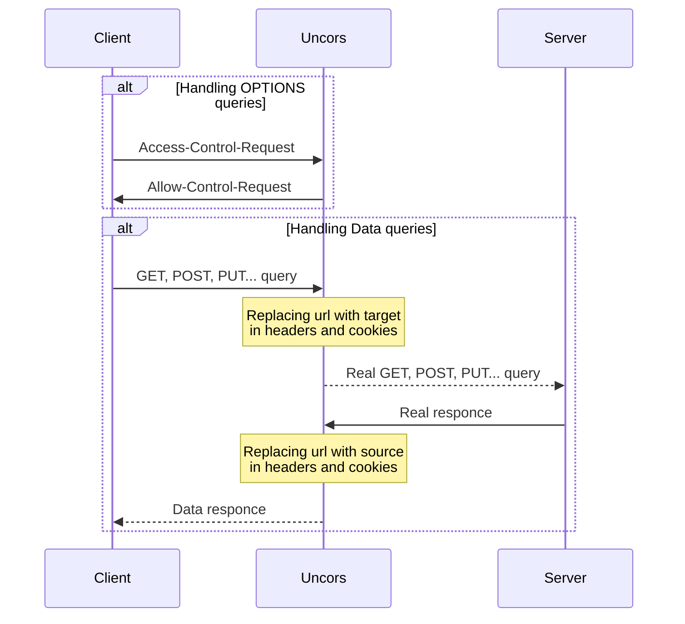

<!--suppress HtmlDeprecatedAttribute -->
<p align="center">
  <a href="https://github.com/evg4b/uncors" title="uncors">
    
  </a>
</p>
<p align="center">
    A simple dev HTTP/HTTPS proxy for replacing CORS headers.
</p>
<p align="center">
    <a href="https://go.dev">
        
    </a>
    <a href="https://github.com/evg4b/uncors/releases">
        
    </a>
    <a href="https://github.com/evg4b/uncors/blob/main/LICENSE">
        
    </a>
    <a href="https://sonarcloud.io/summary/new_code?id=evg4b_uncors">
        
    </a>
    <a href="https://goreportcard.com/report/github.com/evg4b/uncors">
        
    </a>
    <a href="https://sonarcloud.io/summary/new_code?id=evg4b_uncors">
        
    </a>
    <a href="https://sonarcloud.io/summary/new_code?id=evg4b_uncors">
        
    </a>
    <a href="https://sonarcloud.io/summary/new_code?id=evg4b_uncors">
        
    </a>
</p>

# Quick Install

## Homebrew (macOS | Linux)

If you are on macOS or Linux and using [Homebrew](https://brew.sh/), you can install uncors with the following
one-liner:

```bash 
brew install evg4b/tap/uncors
```

## Scoop (Windows)

If you are on Windows and using [Scoop](https://scoop.sh/), you can install uncors with the following commands:

```bash
scoop bucket add evg4b https://github.com/evg4b/scoop-bucket.git
scoop install evg4b/uncors
```

## NPM (Cross-platform)

You can install uncors as node package in yout project with the following commands:

Via npm:

```bash
npm install uncors --save-dev
```

Via yarn:

```bash
yarn add uncors --dev
```

## Binary (Cross-platform)

Download the appropriate version for your platform
from [UNCORS releases page](https://github.com/evg4b/uncors/releases).
Once downloaded, the binary can be run from anywhere. You don’t need to install it into a global location.
This works well for shared hosts and other systems where you don’t have a privileged account.

Ideally, you should install it somewhere in your `PATH` for easy use. `/usr/local/bin` is the most probable location.

## Docker

We currently offer images for Docker https://hub.docker.com/r/evg4b/uncors

```bash
docker run -p 80:3000 evg4b/uncors --from 'http://local.github.com' --to 'https://github.com'
```

## Source

**Prerequisite Tools**

- Git
- Go (at least Go 1.11)

**Fetch from GitHub**

UNCORS uses the Go Modules support built into Go 1.11 to build. The easiest way to get started is to clone
UNCORS source code in a directory outside the GOPATH, as in the following example:

```
mkdir $HOME/src
cd $HOME/src
git clone https://github.com/evg4b/uncors.git
cd uncors
go install -tags release
```

If you are a Windows user, substitute the $HOME environment variable above with `%USERPROFILE%`.

# Usage

```
uncors --http-port 8080 --to 'https://github.com' --from 'http://localhost'
```

## Parameters

* `--from` - Local host with protocol for to the resource from which proxying will take place.
* `--to` - Target host with protocol for to the resource to be proxy.
* `--http-port` - Local HTTP listened port.
* `--https-port` - Local HTTPS listened port.
* `--cert-file` - Path to HTTPS certificate file.
* `--key-file` - Path to matching for certificate private key.
* `--proxy` - HTTP/HTTPS proxy to provide requests to real server (used system by default).
* `--config` - Configuration file with defined [mocks](#mocks)
* `--debug` - Show debug output.

## Mocks

Uncors has endpoint mocks mechanism.
All mocks should be defined in yaml file and passed as parameter `--mocks`.
Currently available path, method, queries and headers filters
(for more information see [gorilla/mux](https://github.com/gorilla/mux#matching-routes) route matching).

**Mocks file example:**

```yaml
- path: /raw-content-endpont
  response:
    code: 200
    raw-content: '
      Hello word
    '
- path: /file-content-endpont
  response:
    code: 200
    file: ~/hello-word.json
- path: /raw-content-endpont
  method: POST
  queries:
    param1: param 1 value
    param2: param 1 value
  headers:
    header1: header 1 value
    header2: header 2 value
  response:
    code: 200
    headers:
      header1: header 1 value
      header2: header 2 value
    raw-content: '
      { "status": "ok" }
    '
- path: /file-content-endpont
  method: POST
  queries:
    param1: param 1 value
    param2: param 1 value
  headers:
    header1: header 1 value
    header2: header 2 value
  response:
    code: 200
    headers:
      header1: header 1 value
      header2: header 2 value
    file: ~/hello-word.json
```

## How it works


