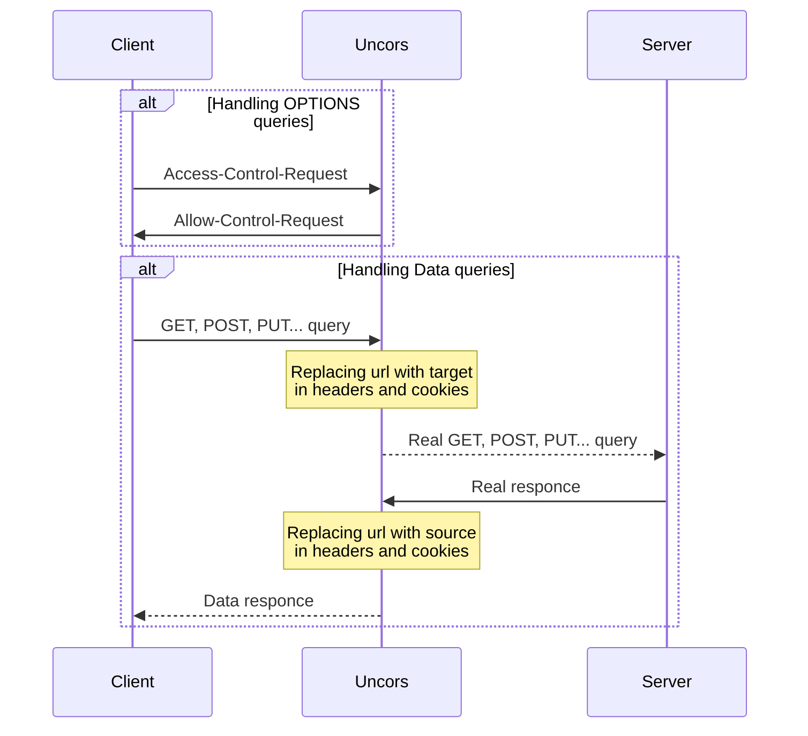

<p align="center">
  <a href="https://github.com/evg4b/uncors" title="uncors">
    
  </a>
</p>
<p align="center">
    A simple dev HTTP/HTTPS proxy for replacing CORS headers.
</p>
<p align="center">
    <a href="https://go.dev">
        
    </a>
    <a href="https://github.com/evg4b/uncors/releases">
        
    </a>
    <a href="https://github.com/evg4b/uncors/blob/main/LICENSE">
        
    </a>
    <a href="https://sonarcloud.io/summary/new_code?id=evg4b_uncors">
        
    </a>
    <a href="https://goreportcard.com/report/github.com/evg4b/uncors">
        
    </a>
    <a href="https://sonarcloud.io/summary/new_code?id=evg4b_uncors">
        
    </a>
    <a href="https://sonarcloud.io/summary/new_code?id=evg4b_uncors">
        
    </a>
    <a href="https://sonarcloud.io/summary/new_code?id=evg4b_uncors">
        
    </a>
</p>

# Quick Install 

## Homebrew (macOS | Linux)

If you are on macOS or Linux and using [Homebrew](https://brew.sh/), you can install Hugo with the following one-liner:

```bash 
brew install evg4b/tap/uncors
```

## Binary (Cross-platform) 

Download the appropriate version for your platform from [UNCORS releases page](https://github.com/evg4b/uncors/releases). Once downloaded, the binary can be run from anywhere. You don’t need to install it into a global location. This works well for shared hosts and other systems where you don’t have a privileged account.

Ideally, you should install it somewhere in your `PATH` for easy use. `/usr/local/bin` is the most probable location.

## Docker 

We currently offer images for Docker https://hub.docker.com/r/evg4b/uncors

```bash
docker run -p 3000:3000 evg4b/uncors --source http://local.github.com --target //github.com
```

## Source 

**Prerequisite Tools**
- Git
- Go (at least Go 1.11)

**Fetch from GitHub** 

UNCORS uses the Go Modules support built into Go 1.11 to build. The easiest way to get started is to clone UNCORS source code in a directory outside of the GOPATH, as in the following example:

```
mkdir $HOME/src
cd $HOME/src
git clone https://github.com/evg4b/uncors.git
cd uncors
go install
```

If you are a Windows user, substitute the $HOME environment variable above with `%USERPROFILE%`.

# Usage
```
./uncors --port 8080 --target 'https://github.com' --source 'http://localhost'
```

## Parameters

* `--source` - Local host with protocol for to the resource from which proxying will take place.
* `--target` - Target host with protocol for to the resource to be proxyed.
* `--http-port` - Local HTTP linthing port.
* `--https-port` - Local HTTPS linthing port. 
* `--cert-file` - Path to HTTPS certificate file.
* `--key-file` - Path to matching for certificate private key.


## How it works 


