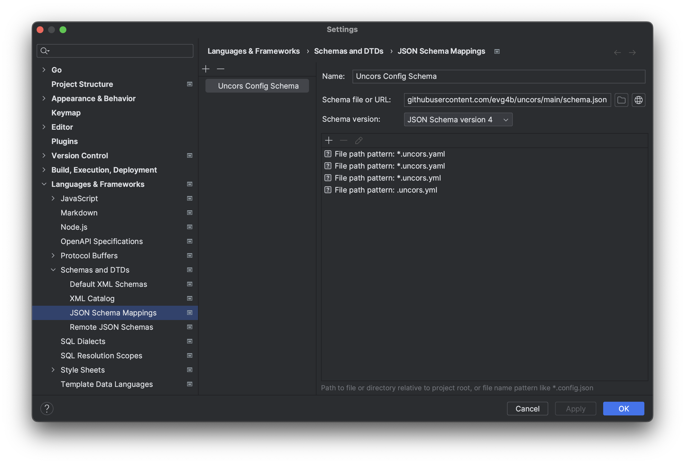
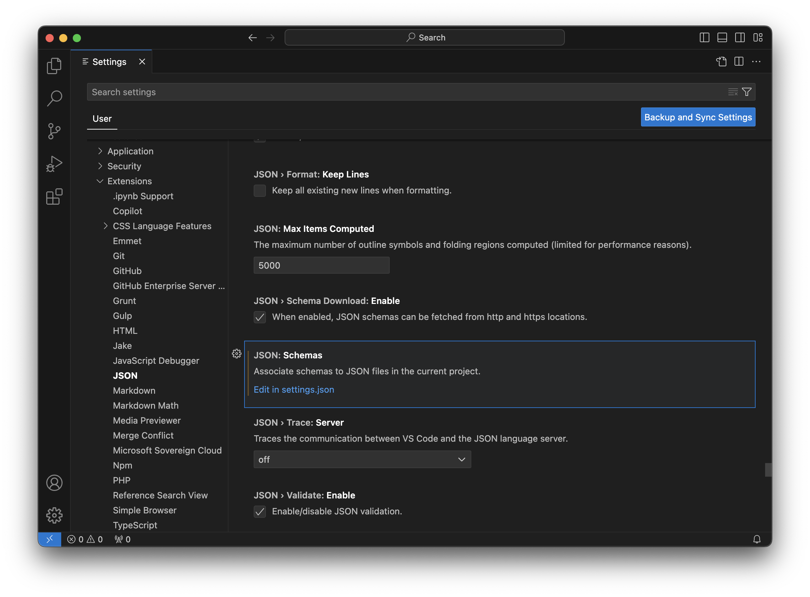
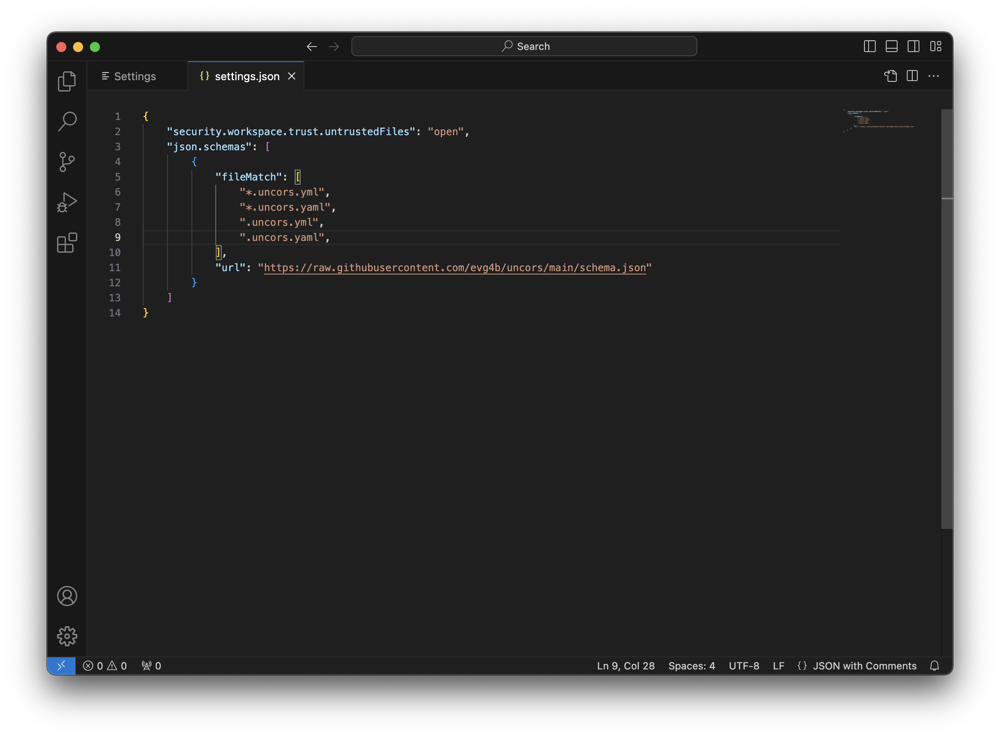

# Configuration

UNCORS supports two configuration methods: command-line arguments and configuration files. When both are used, CLI arguments take precedence and will override settings defined in the configuration file.

The configuration system is built around the concept of host mappings, which translate local domains (defined in your hosts file) to external domains. Configuration settings are organized into two levels:

- **Global Configuration**: Settings that apply to all mappings and control core server behavior
- **Mapping Configuration**: Settings specific to individual host mappings that determine how requests are handled and responses are generated

## Quick Reference

**Minimal configuration:**

```yaml
mappings:
  - from: http://api.local:3000
    to: https://api.example.com
```

**Common configuration patterns:**

```yaml
# Basic proxy with caching
mappings:
  - from: http://api.local:3000
    to: https://api.example.com
    cache:
      - /api/**

# Proxy with static files (SPA)
mappings:
  - from: http://app.local:3000
    to: https://api.example.com
    statics:
      - path: /
        dir: ./dist
        index: index.html

# Proxy with mocked endpoints
mappings:
  - from: http://api.local:3000
    to: https://api.example.com
    mocks:
      - path: /api/test
        response:
          code: 200
          raw: '{"status": "ok"}'
```

> [!TIP]
> For complete working examples, see [Real-World Examples](./11.-Real-World-Examples)

## Table of Contents

- [Command-Line Options](#command-line-options)
- [Configuration File](#configuration-file)
- [Global Configuration](#global-configuration-properties)
- [Mapping Configuration](#mapping-configuration)
  - [Protocol Scheme Mapping](#protocol-scheme-mapping)
  - [Wildcard Mapping](#wildcard-mapping)
  - [OPTIONS Request Handling](#options-request-handling)
- [HTTPS Configuration](#https-configuration)
- [Proxy Configuration](#proxy-configuration)
- [Configuration Schema Validation](#configuration-schema-validation)

---

# Command-Line Options

Configure the UNCORS proxy server using the following command-line parameters:

## Mapping Configuration

| Parameter | Short | Description                                                                                                                         |
| --------- | ----- | ----------------------------------------------------------------------------------------------------------------------------------- |
| `--from`  | `-f`  | Source host with protocol and port (e.g., `http://localhost:8080`). Port defaults to 80 for HTTP and 443 for HTTPS if not specified |
| `--to`    | `-t`  | Target host with protocol to proxy requests to (e.g., `https://api.example.com`)                                                    |

Multiple `--from`/`--to` pairs can be specified to define additional mappings. Each mapping can use a different port by specifying it in the URL.

## Global Configuration

| Parameter     | Short | Description                                |
| ------------- | ----- | ------------------------------------------ |
| `--cert-file` |       | Path to HTTPS certificate file             |
| `--key-file`  |       | Path to certificate private key file       |
| `--proxy`     |       | HTTP/HTTPS proxy URL for upstream requests |
| `--config`    |       | Path to YAML configuration file            |
| `--debug`     |       | Enable debug logging output                |

> [!NOTE]
> CLI parameters override configuration file settings.

# Configuration File

UNCORS uses YAML format for configuration files. Below is a comprehensive example demonstrating all available options:

```yaml
# global configuration
debug: false
proxy: localhost:8080
cert-file: ~/server.crt
key-file: ~/server.key

# mappings configuration
mappings:
  - http://localhost:8080: https://github.com
  - from: http://other.domain.com:3000
    to: https://example.com
    statics:
      /path: ./public
      /another-path: ~/another-static-dir
    mocks:
      - path: /hello
        response:
          code: 200
          delay: 1m 30s
          raw: "Hello world"
      - path: /world
        method: POST
        response:
          code: 203
          delay: 5s
          file: ./path/to/file.data
    scripts:
      - path: /api/custom
        method: POST
        script: |
          local json = require("json")
          local data = json.decode(request.body)
          response.headers["Content-Type"] = "application/json"
          response:WriteHeader(200)
          response:WriteString(json.encode({status = "ok", received = data}))
```

# Global Configuration Properties

| Property    | Type    | Default | Description                                     |
| ----------- | ------- | ------- | ----------------------------------------------- |
| `cert-file` | string  | -       | Path to HTTPS certificate file                  |
| `key-file`  | string  | -       | Path to certificate private key file            |
| `proxy`     | string  | -       | HTTP/HTTPS proxy URL for upstream requests      |
| `debug`     | boolean | false   | Enable debug logging output                     |
| `mappings`  | array   | []      | List of host mapping configurations (see below) |

# Mapping Configuration

The `mappings` section defines how UNCORS routes and handles requests. Each mapping entry specifies a source and destination host pair along with optional processing rules:

```yaml
mappings:
  - from: http://localhost:8080
    to: https://github.com
    mocks: [...]
    statics: [...]
    scripts: [...]
```

This configuration forwards all requests from `http://localhost:8080` to `https://github.com`. The port is specified in the `from` URL and defaults to 80 for HTTP and 443 for HTTPS if omitted. Additional features like mocking, static file serving, and scripting can be configured per mapping. See [Response Mocking](./3.-Response-mocking), [Static File Serving](./4.-Static-file-serving), and [Script Handler](./9.-Script-Handler) for details.

### OPTIONS Request Handling

By default, UNCORS intercepts and handles `OPTIONS` requests locally to facilitate CORS preflight checks. The default response includes:

- `Access-Control-Allow-Origin: *`
- `Access-Control-Allow-Methods: GET, POST, PUT, DELETE, PATCH, OPTIONS`

**Disabling OPTIONS handling:**

```yaml
mappings:
  - from: http://localhost:8080
    to: https://github.com
    options-handling:
      disabled: true
```

**Customizing OPTIONS response headers:**

```yaml
mappings:
  - from: http://localhost:8080
    to: https://github.com
    options-handling:
      headers:
        Access-Control-Allow-Origin: http://localhost
        Access-Control-Allow-Methods: GET, POST
```

> [!NOTE]
> UNCORS adds standard CORS headers to all responses. Custom headers specified here will override the defaults.

## Protocol Scheme Mapping

UNCORS supports flexible protocol scheme mapping, allowing requests to be redirected between HTTP and HTTPS or to preserve the original scheme.

**HTTP to HTTPS mapping:**

```yaml
mappings:
  - from: http://localhost:8080
    to: https://site.com
```

or

```yaml
mappings:
  - from: https://localhost:8443
    to: http://site.com
```

**Scheme-agnostic mapping:**

Using `//` as the scheme creates a mapping that matches both HTTP and HTTPS requests.

Redirect all requests to HTTPS:

```yaml
mappings:
  - from: //localhost:8080
    to: https://site.com
```

Preserve the original request scheme:

```yaml
mappings:
  - from: //localhost:8080
    to: //site.com
```

> [!NOTE]
> HTTPS mappings require valid SSL/TLS certificates. See [HTTPS Configuration](#https-configuration) for setup instructions.

## Wildcard Mapping

UNCORS supports wildcard patterns in host mappings for flexible domain matching. The `*` wildcard matches any sequence of characters except `.` (dot) and `/` (slash), enabling you to handle multiple subdomains or implement dynamic routing.

**Example 1: Static target with wildcard source**

```yaml
mappings:
  - from: http://*.local.com:8080
    to: https://github.com
```

All requests matching the `*.local.com` pattern on port 8080 are forwarded to the same target:

| Local request                           | Target request                  |
| --------------------------------------- | ------------------------------- |
| `http://raw.local.com:8080`             | `https://github.com`            |
| `http://raw.local.com:8080/api/info`    | `https://github.com/api/info`   |
| `http://docs.local.com:8080`            | `https://github.com`            |
| `http://docs.local.com:8080/index.html` | `https://github.com/index.html` |

**Example 2: Dynamic subdomain mapping**

```yaml
mappings:
  - from: http://*.local.com:8080
    to: https://*.github.com
```

The wildcard value captured from the source is substituted into the target URL:

| Local request                           | Target request                       |
| --------------------------------------- | ------------------------------------ |
| `http://raw.local.com:8080`             | `https://raw.github.com`             |
| `http://raw.local.com:8080/api/info`    | `https://raw.github.com/api/info`    |
| `http://docs.local.com:8080`            | `https://docs.github.com`            |
| `http://docs.local.com:8080/index.html` | `https://docs.github.com/index.html` |

> [!NOTE]
> **Multiple wildcards:** When using multiple `*` characters, they are matched and replaced in order of appearance from left to right.

## Simplified Syntax

For basic mappings without mocking or static file serving, use the shorthand syntax:

```yaml
mappings:
  - http://localhost:8080: https://github.com
```

Both syntax styles can be mixed within the same configuration file:

```yaml
mappings:
  - http://localhost:8080: https://github.com
  - http://host1:3000: https://gitlab.com
  - http://*.com:8080: https://*.io
  - from: http://host2:9090
    to: https://gitea.com
    mocks: [...]
    statics: [...]
```

> [!WARNING]
> Domain mappings only work for hosts defined in your system's hosts file. A wildcard mapping like `https://*` will not intercept all internet traffic—only requests to domains explicitly configured in your hosts file.

# HTTPS Configuration

UNCORS supports HTTPS for both incoming requests and upstream connections. HTTPS functionality requires valid SSL/TLS certificates—both production certificates and self-signed certificates are supported.

**Certificate requirements:**

- Certificate file (`.crt` or `.pem`)
- Private key file (`.key`)

**Configuration example:**

```yaml
cert-file: ~/path/to/cert.crt
key-file: ~/path/to/cert.key
```

**Mapping configuration for HTTPS:**

```yaml
mappings:
  - https://localhost:8443: https://github.com
  # OR
  - //localhost:8443: //github.com
```

> [!NOTE]
> HTTPS server functionality is only activated when at least one mapping uses the `https://` scheme. Each mapping specifies its own port in the `from` URL.

# Proxy Configuration

UNCORS supports routing upstream requests through an HTTP/HTTPS proxy server.

**Automatic proxy detection:**

UNCORS automatically detects and uses system proxy settings from environment variables:

- `HTTP_PROXY` / `http_proxy`
- `HTTPS_PROXY` / `https_proxy`
- `NO_PROXY` / `no_proxy`

Environment variable values can be specified as:

- Full URL: `http://proxy.example.com:8080`
- Host and port: `proxy.example.com:8080` (assumes HTTP)

**Explicit proxy configuration:**

Override system settings using CLI or configuration file:

```bash
uncors --proxy http://proxy.example.com:8080 --from http://localhost --to https://api.example.com
```

```yaml
proxy: http://proxy.example.com:8080
```

# Configuration Schema Validation

UNCORS provides a JSON Schema for configuration file validation, offering autocomplete and error checking in supported editors.

**Automatic validation:**

Most modern editors with SchemaStore support will automatically validate UNCORS configuration files.

**Manual schema configuration:**

## JetBrains IDEs (IntelliJ, WebStorm, etc.)

1. Navigate to: **Settings** → **Languages & Frameworks** → **Schemas and DTDs** → **JSON Schema Mappings**
2. Click **+** to add a new mapping
3. Configure with the following settings:
   - **Name:** `Uncors Config Schema`
   - **Schema file or URL:** `https://raw.githubusercontent.com/evg4b/uncors/main/schema.json`
   - **Schema version:** JSON Schema version 4
   - **File path patterns:** `*.uncors.yml`, `*.uncors.yaml`, `.uncors.yml`, `.uncors.yaml`



## Visual Studio Code

1. Open **Settings** → **Extensions** → **JSON** → **JSON: Schemas**
2. Click **Edit in settings.json**



3. Add the following to the `json.schemas` array:

```json
{
  "fileMatch": ["*.uncors.yml", "*.uncors.yaml", ".uncors.yml", ".uncors.yaml"],
  "url": "https://raw.githubusercontent.com/evg4b/uncors/main/schema.json"
}
```



## Other Editors

For other editors with JSON Schema support, use these parameters:

| Parameter          | Value                                                             |
| ------------------ | ----------------------------------------------------------------- |
| **Schema URL**     | `https://raw.githubusercontent.com/evg4b/uncors/main/schema.json` |
| **Schema Version** | JSON Schema version 4                                             |
| **File Patterns**  | `*.uncors.yml`, `*.uncors.yaml`, `.uncors.yml`, `.uncors.yaml`    |
