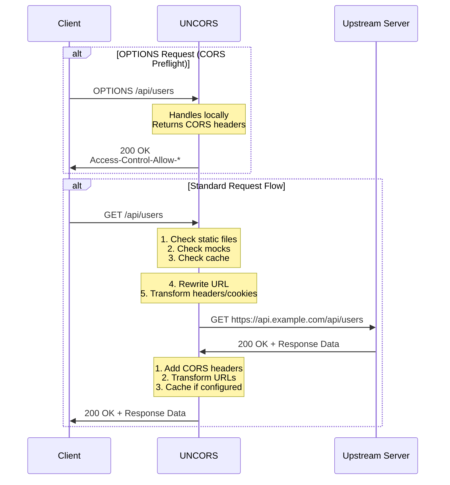

# Request Flow

This diagram illustrates how UNCORS processes requests and responses between the client and upstream server.

## Request Processing Order

UNCORS processes each request through the following stages:

1. **OPTIONS Handling**: CORS preflight requests are handled locally (unless disabled)
2. **Static Files**: Check if path matches configured static file directories
3. **Mocks**: Check if request matches any mock configurations
4. **Cache**: Check if a cached response exists (for configured paths)
5. **Rewrites**: Apply path and host rewriting rules
6. **Proxy**: Forward request to upstream server
7. **Transform**: Modify response headers and add CORS headers
8. **Cache Store**: Store response in cache if applicable

## URL and Header Transformation

### Request (Client → Server)

- Source domain URLs in headers are replaced with target domain
- Cookie domains are rewritten to match target server
- Authorization and authentication headers are preserved

### Response (Server → Client)

- Target domain URLs in headers are replaced with source domain
- Cookie domains are rewritten to match client origin
- CORS headers are added or modified
- Location headers (redirects) are transformed to use source domain
